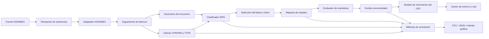
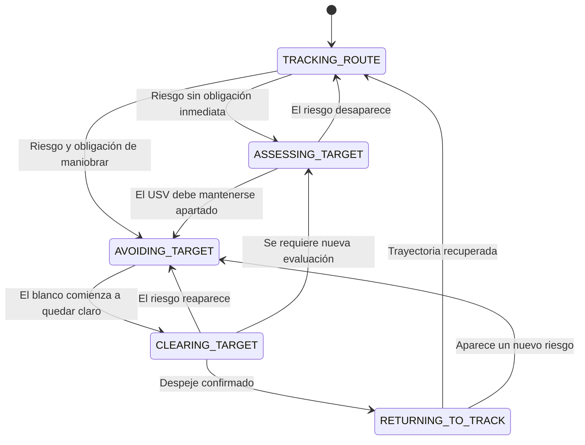

# USV AIS Evasion

Algoritmo de gobierno autónomo para la evasión de blancos móviles por parte de un vehículo de superficie no tripulado —USV— utilizando información cinemática proveniente del Sistema de Identificación Automática —AIS—.

El proyecto recibe y decodifica sentencias AIS encapsuladas en NMEA 0183, realiza seguimiento de blancos, calcula parámetros de aproximación, clasifica las situaciones de encuentro conforme al RIPA/COLREG y recomienda un rumbo evasivo considerando la dinámica de giro del USV.

> **Estado del proyecto:** prototipo académico en desarrollo y evaluación mediante simulación. El sistema actualmente genera recomendaciones y órdenes de rumbo dentro del entorno simulado; no controla directamente un autopiloto real.

---

## 1. Objetivo

Desarrollar una arquitectura modular capaz de:

1. Recibir sentencias AIS/NMEA desde archivos de simulación o una interfaz serial.
2. Decodificar mensajes AIS de posición y extraer variables cinemáticas.
3. Mantener un registro actualizado de los blancos detectados.
4. Calcular distancia, punto de máxima aproximación y tiempo al punto de máxima aproximación —CPA/PMA y TCPA—.
5. Determinar la geometría relativa entre el USV y cada blanco.
6. Clasificar situaciones de cruce, alcance y vuelta encontrada conforme al RIPA.
7. Determinar el rol del USV como embarcación que debe mantenerse apartada o mantener rumbo y velocidad.
8. Evaluar maniobras candidatas considerando la razón de giro del USV.
9. Recomendar un rumbo seguro y posteriormente retornar a la trayectoria original.
10. Registrar métricas de seguridad, eficiencia y estabilidad para evaluar el algoritmo.

---

## 2. Alcance actual

La versión actual permite:

* Generar escenarios AIS representativos.
* Procesar sentencias `!AIVDM` con mensajes AIS de posición.
* Leer datos AIS desde archivos o desde una conexión serial.
* Traquear uno o más blancos mediante su MMSI.
* Calcular CPA/PMA, TCPA y distancia relativa.
* Calcular demarcación verdadera, demarcación relativa y sector del blanco.
* Clasificar encuentros marítimos relevantes para el RIPA.
* Seleccionar el blanco con mayor nivel de criticidad.
* Administrar el comportamiento mediante una máquina de estados.
* Evaluar cambios de rumbo progresivos a estribor.
* Considerar la razón de giro o `turn rate` del USV.
* Mantener la maniobra hasta confirmar el despeje del blanco.
* Retornar al rumbo original cuando la situación vuelve a ser segura.
* Ejecutar escenarios individuales o múltiples escenarios en modalidad batch.
* Generar archivos CSV y JSON con métricas de evaluación.
* Visualizar gráficamente la simulación y el rumbo recomendado.

---

## 3. Arquitectura general



La arquitectura está dividida en módulos con responsabilidades independientes. Esta separación permite modificar el adaptador AIS, los criterios RIPA, el modelo de movimiento o las métricas sin reescribir completamente el algoritmo.

---

## 4. Flujo de procesamiento

### 4.1. Adquisición AIS

Las sentencias pueden obtenerse desde:

* Un archivo de escenario mediante `NmeaFileSource`.
* Una conexión serial mediante `NmeaSerialSource`.
* El generador de mensajes AIS tipo 1 incluido en el proyecto.

### 4.2. Decodificación

`AisNmeaReceiver` valida la sentencia NMEA, comprueba su checksum y decodifica el payload AIS. De los mensajes de posición se obtienen principalmente:

* MMSI.
* Latitud.
* Longitud.
* Velocidad sobre el fondo, SOG.
* Rumbo sobre el fondo, COG.
* Proa verdadera, heading.
* Estado de navegación.
* Marca temporal.

### 4.3. Seguimiento de blancos

`TargetTracker` mantiene un registro de los blancos AIS identificados por MMSI.

Los blancos que no reciben actualizaciones dentro del tiempo máximo configurado son considerados desactualizados y se eliminan del conjunto de blancos activos.

### 4.4. Evaluación cinemática

Para cada blanco activo se calculan:

* Distancia actual.
* CPA o PMA.
* TCPA.
* Existencia de riesgo dentro del horizonte temporal.
* Demarcación verdadera.
* Demarcación relativa.
* Sector del blanco respecto del USV.
* Diferencia entre los cursos de ambas embarcaciones.

### 4.5. Clasificación RIPA

El clasificador identifica las siguientes situaciones:

| Situación          | Condición general                                                             | Rol del USV                |
| ------------------ | ----------------------------------------------------------------------------- | -------------------------- |
| Vuelta encontrada  | Blanco por proa y cursos aproximadamente recíprocos                           | Debe maniobrar             |
| Alcance            | El USV se aproxima desde el sector de popa del blanco y posee mayor velocidad | Debe maniobrar             |
| Siendo alcanzado   | El blanco se aproxima desde la popa del USV y posee mayor velocidad           | Mantiene rumbo y velocidad |
| Cruce por estribor | El blanco se encuentra por el costado de estribor                             | Debe maniobrar             |
| Cruce por babor    | El blanco se encuentra por el costado de babor                                | Mantiene rumbo y velocidad |
| Sin riesgo         | CPA/PMA y TCPA no indican peligro                                             | Mantiene navegación        |
| Indefinido         | Existe riesgo, pero la geometría no permite una clasificación clara           | Actúa con precaución       |

La clasificación solo considera una situación peligrosa cuando el análisis CPA/PMA–TCPA indica riesgo de colisión dentro del horizonte de evaluación.

---

## 5. Máquina de estados

El comportamiento del USV se organiza mediante cinco estados:



### Estados

* `TRACKING_ROUTE`: navegación normal sobre el rumbo establecido.
* `ASSESSING_TARGET`: existe riesgo, pero se evalúa el rol correspondiente al USV.
* `AVOIDING_TARGET`: se ejecuta y mantiene la maniobra evasiva.
* `CLEARING_TARGET`: se confirma mediante varias actualizaciones que el blanco quedó despejado.
* `RETURNING_TO_TRACK`: el USV retorna progresivamente a su rumbo original.

---

## 6. Selección de la maniobra evasiva

Cuando el USV debe mantenerse apartado, el módulo de evasión evalúa una serie de cambios de rumbo a estribor:

```text
5°, 10°, 15°, 20° y 25°
```

Cada rumbo candidato se simula considerando:

* Velocidad del USV.
* Velocidad y rumbo del blanco.
* Radio mínimo de seguridad.
* Horizonte temporal.
* Intervalo de simulación.
* Razón de giro del USV.
* Distancia mínima obtenida durante la maniobra.
* Tiempo necesario para alcanzar el rumbo ordenado.

El algoritmo selecciona el primer cambio de rumbo que mantiene la distancia mínima por sobre el radio de seguridad.

Cuando ninguna alternativa cumple completamente el margen establecido, se selecciona la maniobra que produce la mayor separación como solución de mejor esfuerzo.

---

## 7. Estructura del proyecto

```text
usv-ais-evasion/
│
├── data/
│   ├── scenarios/                   # Escenarios AIS/NMEA y manifiesto
│   ├── results/                     # Resultados CSV y JSON
│   └── sample_nmea.txt              # Sentencias AIS de prueba
│
├── docs/                            # Documentación técnica y metodológica
│
├── src/
│   └── usv_avoidance/
│       ├── __init__.py
│       │
│       ├── ais_adapter.py           # Validación y decodificación AIS/NMEA
│       ├── ais_type1_generator.py   # Generación de mensajes AIS tipo 1
│       ├── nmea_file_source.py      # Lectura secuencial desde archivos
│       ├── nmea_serial_source.py    # Recepción desde puerto serial
│       │
│       ├── target_tracker.py        # Seguimiento de blancos mediante MMSI
│       ├── cpa_tcpa.py              # Distancia, CPA/PMA y TCPA
│       ├── encounter_geometry.py    # Demarcaciones y geometría relativa
│       ├── encounter_classifier.py  # Clasificación de encuentros RIPA
│       │
│       ├── state_machine.py         # Máquina de estados de navegación
│       ├── avoidance.py             # Evaluación de maniobras candidatas
│       ├── motion_model.py          # Movimiento y razón de giro
│       ├── route_manager.py         # Retorno a la trayectoria original
│       │
│       ├── simulation_metrics.py    # Registro de métricas
│       ├── simulation_runner.py     # Ejecución estructurada para interfaces
│       ├── batch_simulation.py      # Ejecución automática de escenarios
│       ├── evaluation_report.py     # Reporte comparativo de resultados
│       │
│       ├── visualizer_ais.py        # Visualización de trayectorias
│       ├── main.py                  # Integración principal por terminal
│       ├── web_app.py               # Servidor de simulación e interfaz web
│       │
│       ├── web_interface/           # Interfaz de recomendación de rumbo
│       └── web_interface_2/         # Interfaz principal de simulación
│
├── tests/                           # Pruebas automáticas
├── pyproject.toml                   # Configuración del paquete Python
├── requirements.txt                 # Dependencias
└── README.md
```

---

## 8. Descripción de los módulos

### Adquisición y decodificación

| Módulo                   | Responsabilidad                                                     |
| ------------------------ | ------------------------------------------------------------------- |
| `ais_type1_generator.py` | Generar sentencias AIS/NMEA para escenarios simulados.              |
| `nmea_file_source.py`    | Entregar sentencias de un archivo de manera secuencial.             |
| `nmea_serial_source.py`  | Recibir sentencias desde un equipo AIS conectado por puerto serial. |
| `ais_adapter.py`         | Validar, ensamblar y decodificar sentencias AIS.                    |

### Análisis del encuentro

| Módulo                    | Responsabilidad                                                      |
| ------------------------- | -------------------------------------------------------------------- |
| `target_tracker.py`       | Mantener el estado actualizado de cada blanco identificado por MMSI. |
| `cpa_tcpa.py`             | Calcular distancia, CPA/PMA, TCPA y riesgo de colisión.              |
| `encounter_geometry.py`   | Calcular demarcaciones y posición relativa del blanco.               |
| `encounter_classifier.py` | Determinar el tipo de encuentro y el rol del USV conforme al RIPA.   |

### Decisión y gobierno

| Módulo             | Responsabilidad                                                          |
| ------------------ | ------------------------------------------------------------------------ |
| `state_machine.py` | Determinar la etapa de navegación en la que se encuentra el USV.         |
| `avoidance.py`     | Simular cambios de rumbo y seleccionar una maniobra segura.              |
| `motion_model.py`  | Actualizar la posición y el rumbo considerando una razón de giro finita. |
| `route_manager.py` | Determinar cuándo y cómo retornar a la trayectoria original.             |
| `main.py`          | Integrar los módulos y ejecutar el algoritmo desde terminal.             |

### Simulación y evaluación

| Módulo                  | Responsabilidad                                                      |
| ----------------------- | -------------------------------------------------------------------- |
| `simulation_metrics.py` | Registrar métricas de seguridad, respuesta y estabilidad.            |
| `simulation_runner.py`  | Ejecutar el algoritmo y entregar resultados estructurados.           |
| `batch_simulation.py`   | Ejecutar automáticamente varios escenarios.                          |
| `evaluation_report.py`  | Consolidar los resúmenes de los escenarios en un archivo CSV.        |
| `visualizer_ais.py`     | Representar gráficamente las trayectorias del USV y los blancos.     |
| `web_app.py`            | Exponer los escenarios y pasos de simulación mediante una API Flask. |

---

## 9. Instalación

### Requisitos

* Python 3.10 o superior.
* Git.
* Entorno virtual de Python recomendado.

### Clonar el repositorio

```bash
git clone https://github.com/cristobalriquelme97-ux/usv-ais-evasion.git
cd usv-ais-evasion
```

### Crear un entorno virtual

Windows:

```powershell
python -m venv .venv
.venv\Scripts\activate
```

Linux o macOS:

```bash
python3 -m venv .venv
source .venv/bin/activate
```

### Instalar dependencias

```bash
python -m pip install --upgrade pip
pip install -r requirements.txt
pip install -e .
```

Para utilizar la visualización y las interfaces web también se requieren:

```bash
pip install matplotlib flask
```

La instalación editable permite ejecutar los módulos desde la raíz del repositorio utilizando:

```bash
python -m usv_avoidance.nombre_del_modulo
```

---

## 10. Generación de escenarios

Los parámetros principales se encuentran en:

```text
src/usv_avoidance/scenario_config.py
```

Entre ellos:

* Posición inicial del USV.
* Velocidad y rumbo inicial del USV.
* Razón de giro.
* MMSI del blanco.
* Posición inicial del blanco.
* Velocidad y rumbo del blanco.
* Duración del escenario.
* Intervalo entre actualizaciones.
* Archivo de salida.

Para generar el escenario configurado:

```bash
python -m usv_avoidance.ais_type1_generator
```

Los archivos generados se almacenan en:

```text
data/scenarios/
```

---

## 11. Ejecución desde terminal

### Listar los escenarios disponibles

```bash
python -m usv_avoidance.main --list-scenarios
```

### Ejecutar el escenario configurado por defecto

```bash
python -m usv_avoidance.main
```

### Ejecutar un escenario específico

```bash
python -m usv_avoidance.main \
    --scenario crossing_starboard_risk_nmea.txt
```

En PowerShell también puede escribirse en una sola línea:

```powershell
python -m usv_avoidance.main --scenario crossing_starboard_risk_nmea.txt
```

### Ejecutar y visualizar el escenario

```bash
python -m usv_avoidance.main \
    --scenario crossing_starboard_risk_nmea.txt \
    --visualize
```

Durante la ejecución se muestran:

* Estado del USV.
* Información cinemática del blanco.
* Distancia actual.
* CPA/PMA y TCPA.
* Demarcaciones.
* Clasificación del encuentro.
* Rol del USV.
* Estado del algoritmo.
* Maniobra seleccionada.
* Rumbo ordenado.
* Resumen final de métricas.

---

## 12. Ejecución batch

Para ejecutar todos los escenarios disponibles:

```bash
python -m usv_avoidance.batch_simulation
```

Para ejecutar solamente los escenarios que contienen la palabra `risk`:

```bash
python -m usv_avoidance.batch_simulation --pattern "*risk*.txt"
```

Para detener la ejecución cuando un escenario presenta un error:

```bash
python -m usv_avoidance.batch_simulation --stop-on-error
```

Los resultados y registros se almacenan en:

```text
data/results/
data/results/logs/
```

---

## 13. Reporte comparativo

Después de ejecutar los escenarios puede generarse una tabla comparativa:

```bash
python -m usv_avoidance.evaluation_report
```

El reporte consolida los archivos `*_summary.json` y genera:

```text
data/results/evaluation_summary.csv
```

---

## 14. Interfaces web

El proyecto contiene dos vistas complementarias:

1. Una interfaz para seleccionar y visualizar escenarios.
2. Una interfaz para mostrar el estado del algoritmo y el rumbo recomendado.

### Servidor principal de simulación

```bash
python -m usv_avoidance.web_app
```

Por defecto estará disponible en:

```text
http://127.0.0.1:5000
```

### Interfaz de recomendación de rumbo

En otra terminal:

```bash
python src/usv_avoidance/web_interface/app.py
```

Por defecto estará disponible en:

```text
http://127.0.0.1:4500
```

La interfaz de recomendación consulta el paso que se está reproduciendo en el servidor principal y presenta:

* Posición, velocidad y rumbo del USV YAGÁN.
* Blancos AIS activos.
* Blanco prioritario.
* CPA/PMA.
* TCPA.
* Distancia actual.
* Tipo de encuentro.
* Estado de navegación.
* Acción recomendada.
* Rumbo recomendado.

---

## 15. Métricas de evaluación

### Seguridad

* Distancia mínima real.
* CPA/PMA mínimo calculado.
* Margen mínimo respecto del radio de seguridad.
* Violación del radio de seguridad.
* Primer instante de detección de riesgo.
* Primer instante de violación de seguridad.

### Respuesta

* Tiempo de reacción.
* Tiempo total en evasión.
* Tiempo de confirmación de despeje.
* Tiempo de retorno a la trayectoria.

### Eficiencia y estabilidad

* Recuperación de la trayectoria original.
* Desviación máxima del rumbo.
* Cantidad de cambios de estado.
* Cantidad de cambios en el rumbo ordenado.
* Variación total del rumbo.
* Máximo cambio de rumbo ordenado.
* Cantidad total de muestras procesadas.

Un escenario se considera exitoso cuando la maniobra mantiene una separación segura y el USV completa adecuadamente el ciclo de evasión y retorno.

---

## 16. Pruebas

Para ejecutar las pruebas automáticas:

```bash
pytest
```

O con mayor detalle:

```bash
pytest -v
```

Las pruebas se encuentran en:

```text
tests/
```

---

## 17. Supuestos y limitaciones

Este repositorio corresponde a un prototipo de investigación. Entre sus principales supuestos y limitaciones se encuentran:

* El movimiento se representa en un plano horizontal.
* Los blancos mantienen velocidad y rumbo constantes durante cada predicción.
* La dinámica del USV se simplifica mediante una razón de giro máxima.
* La maniobra evasiva modifica principalmente el rumbo, manteniendo la velocidad.
* Los criterios RIPA se implementan mediante reglas geométricas y umbrales configurables.
* El CPA/PMA y TCPA se calculan a partir de la información AIS disponible.
* La información AIS puede presentar retardos, errores o periodos sin actualización.
* AIS no debe considerarse el único sensor para un sistema real de prevención de abordajes.
* El algoritmo todavía no se encuentra certificado para operación marítima.
* El rumbo recomendado se aplica actualmente al modelo de simulación y no directamente a un autopiloto.

---

## 18. Líneas de desarrollo

* Integración con una fuente AIS física mediante conexión serial.
* Recepción de información propia mediante `AIVDO`, GNSS o autopiloto.
* Integración con ArduPilot mediante MAVLink.
* Evaluación de escenarios con múltiples blancos simultáneos.
* Incorporación de incertidumbre en posición, velocidad y rumbo AIS.
* Evaluación de maniobras con cambios de velocidad.
* Inclusión de condiciones ambientales como viento, corriente y oleaje.
* Ampliación de pruebas unitarias y de integración.
* Análisis de sensibilidad de los umbrales CPA/PMA y TCPA.
* Validación mediante pruebas de campo con el USV YAGÁN.

---

## 19. Contexto académico

Este repositorio forma parte del desarrollo de una tesis orientada al diseño de un algoritmo de gobierno autónomo para la evasión de blancos móviles en un USV.

El proyecto estudia la integración de:

* Comunicaciones AIS/NMEA.
* Seguimiento de blancos móviles.
* Análisis CPA/PMA–TCPA.
* Clasificación de encuentros conforme al RIPA.
* Generación de maniobras evasivas.
* Evaluación del desempeño mediante simulación.

---

## 20. Advertencia

Este software fue desarrollado con fines académicos y experimentales.

No debe utilizarse como único medio de navegación, prevención de abordajes o gobierno de una embarcación real sin procedimientos adicionales de validación, redundancia sensorial, supervisión humana y cumplimiento de la normativa marítima aplicable.
